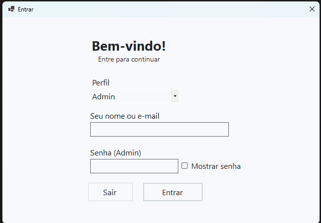
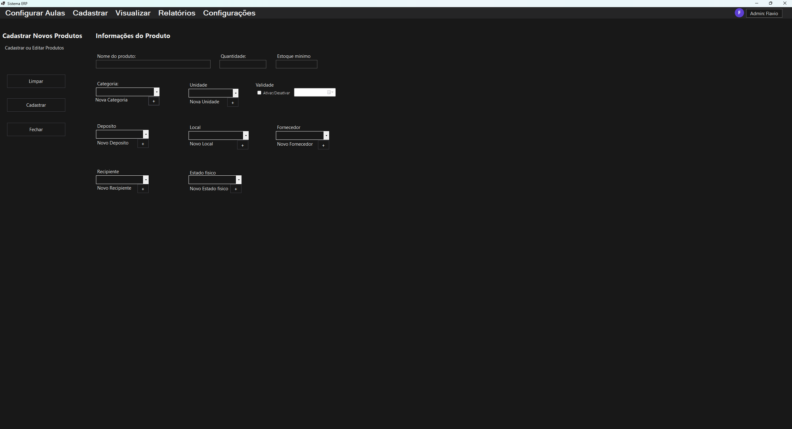
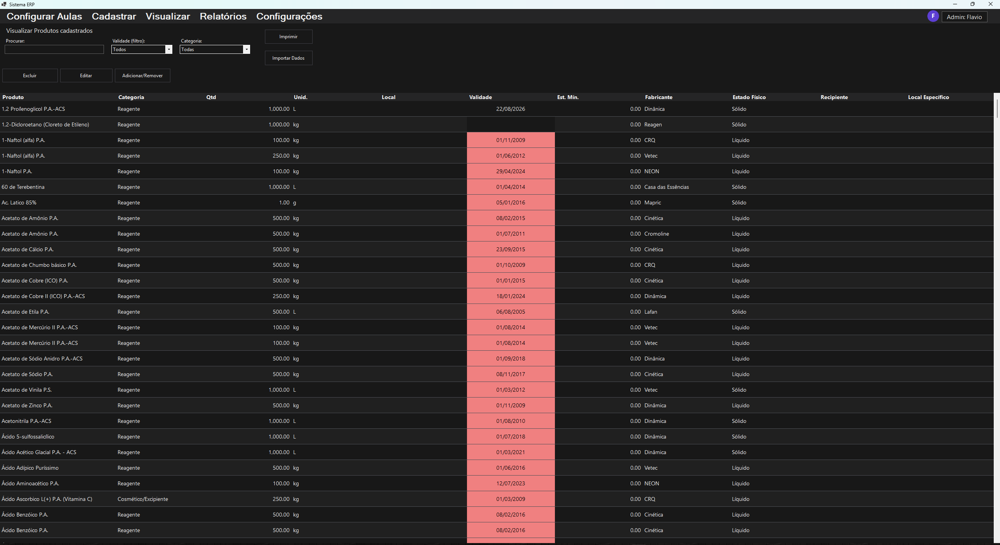
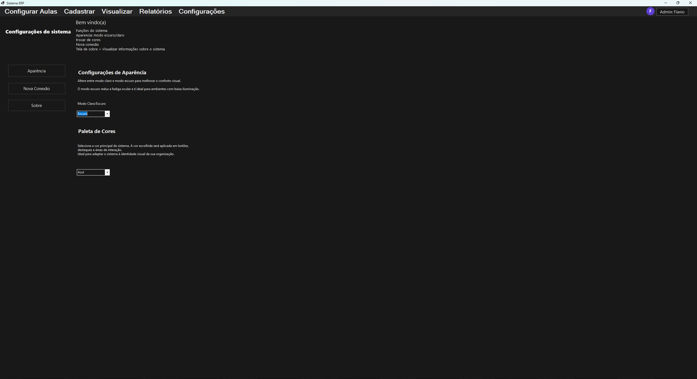
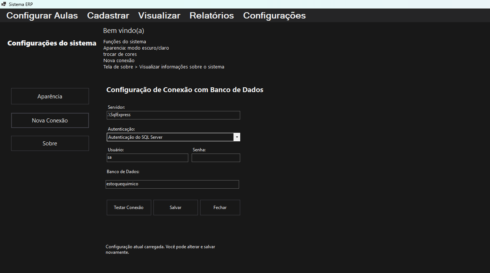

Gerenciador de Estoque
Projeto desenvolvido como TCC com o objetivo de facilitar o controle de produtos, a consulta de itens em estoque e a organização das informações dentro do sistema.
Sobre o projeto
O sistema foi criado para reunir em um só lugar as funções principais de um controle de estoque, deixando o uso mais simples e direto no dia a dia.
Entre as funções do projeto estão:
login de acesso
cadastro de produtos
visualização de estoque
configurações do sistema
configuração do banco de dados
Tecnologias utilizadas
C#
.NET
Windows Forms
Banco de dados
Organização do projeto
O projeto está dividido em pastas para separar melhor cada parte do sistema:
```text
Data/
Infra/
Models/
Services/
Telas/
Utils/
Program.cs
```
Telas do sistema
Login

Cadastro de produto

Estoque

Configurações

Configuração do banco de dados

Objetivo
Este projeto foi desenvolvido para ajudar no controle de estoque de forma mais organizada, permitindo cadastrar produtos, acompanhar os itens disponíveis e centralizar informações importantes em uma única aplicação.
Como abrir
Abra a solução no Visual Studio ou no Visual Studio Code, restaure as dependências do projeto e execute normalmente no ambiente .NET já configurado.
Autor
Flavio Crepaldi
GitHub: sr4kkk
